# Structured Notes Intelligence Engine — Guided Tour

> No presenter needed. This document walks you through the app from scratch.  
> Open the app at [http://localhost:3000](http://localhost:3000) and follow along.

---

## What this tool does

Structured notes are complex financial instruments — autocallables, barrier notes, reverse convertibles — where the payoff depends on conditions buried in dense legal term sheets. Analysts currently read these manually, field by field, to extract the data they need.

This tool ingests a term sheet PDF, runs an AI extraction pipeline, scores its own confidence on every field it extracts, and flags logical inconsistencies across fields. The analyst's job shifts from extraction to review — verify the low-confidence fields, accept the high-confidence ones, and let the tool do the heavy lifting on everything in between.

---

## 1. The Notes Dashboard

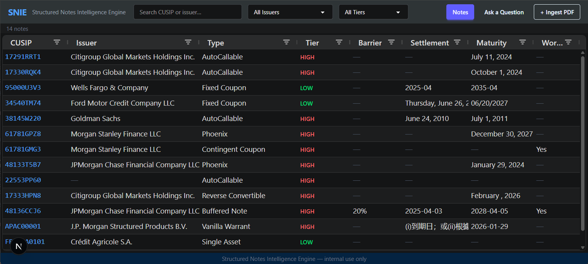

The main grid shows every ingested note. Each row is a contract — CUSIP, issuer, note type, risk tier, and key terms at a glance.

The **Tier** column is the first signal. It's assigned automatically during ingest based on structural complexity:

- **HIGH** — complex structures (barriers, autocalls, worst-of features). Full 52-field extraction. Warrants the closest review.
- **MEDIUM** — moderate complexity. Core fields extracted.
- **LOW** — simple or standard structure. Metadata-level extraction only.

Use the issuer and tier filters in the header to narrow the list. The search bar accepts CUSIP or issuer name.

---

## 2. Ingesting a Term Sheet

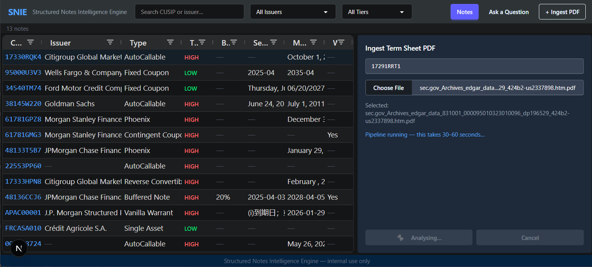

Click **+ Ingest PDF** in the top right. Enter the CUSIP, select the PDF (424B2 filing from EDGAR works best), and hit Upload.

The pipeline runs for 30–60 seconds. It is doing the following in sequence:

1. Parses and chunks the PDF
2. Embeds the chunks into the vector store
3. Triages the note to assign a risk tier
4. Runs LLM extraction — 52 fields for HIGH tier notes
5. Scores confidence on every extracted field and records reasoning
6. Detects cross-field conflicts
7. Persists everything to the database

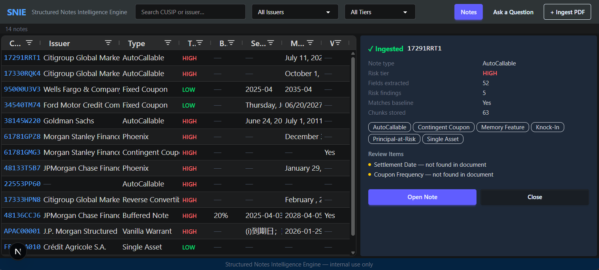

When complete, the summary card shows note type, risk tier, fields extracted, risk findings, and structure tags. Click **Open Note** to go directly to the detail view.

---

## 3. Note Detail — Overview Tab

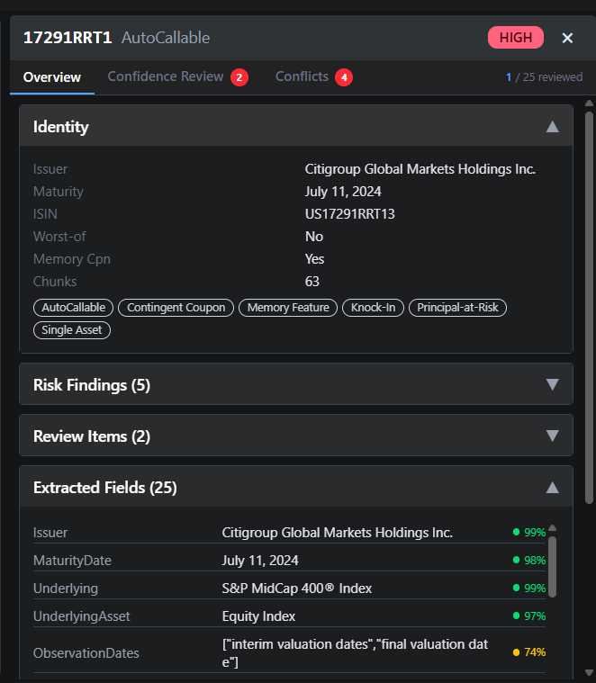

The Overview tab is the starting point for any note. Three sections:

**Identity** — issuer, maturity, ISIN, structure tags. The tags (AutoCallable, Contingent Coupon, Memory Feature, etc.) are detected automatically and tell you immediately what kind of contract you're dealing with.

**Risk Findings** — terms flagged by the pipeline as structurally significant (barriers, worst-of features, knock-in conditions). Each finding links back to the passage in the contract where it appears.

**Extracted Fields** — every field the pipeline pulled from the document, with a confidence dot next to each value. Green is high confidence, yellow is worth a look, red needs manual verification. Click any field row to jump directly to its full detail in the Confidence Review tab.

---

## 4. Confidence Review Tab

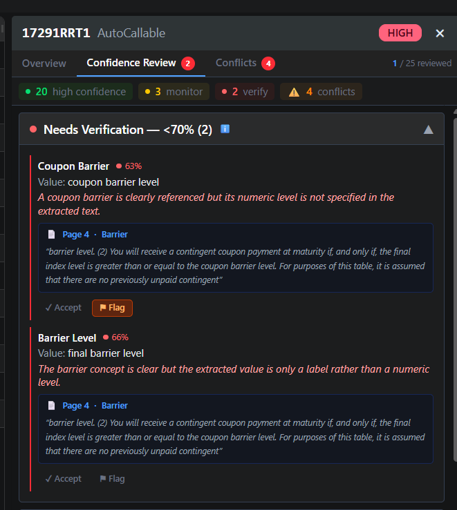

The Confidence Review tab is where the analyst does their actual review work. Fields are grouped into three tiers:

- **Needs Verification (<70%)** — the model extracted something but wasn't confident. These fields need a human eye before they go downstream.
- **Monitor (70–89%)** — the extraction looks plausible but the model had some uncertainty. Worth a second look.
- **High Confidence (≥90%)** — the model is confident. These can typically be accepted without deep review.

The sticky header at the top shows the count for each tier and the conflicts count. Clicking any badge scrolls directly to that section — useful once the list gets long.

The **X / Y reviewed** counter in the top right tracks analyst progress across the note.

---

## 5. Field Selection and Source Citation

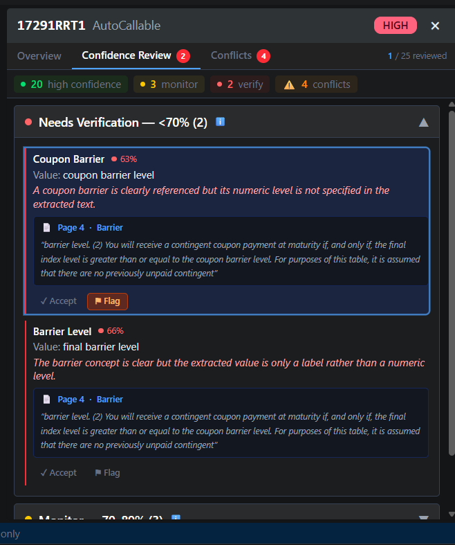

Click any field card to select it. Two things appear:

**Reasoning** — the model's explanation for why it scored this field at this confidence level, in plain language. If confidence is low, it will tell you exactly what it found and what was ambiguous.

**Source citation** — the verbatim passage from the PDF that the model used to make the extraction, with page number and section. This text can be Ctrl+F'd directly in the original document. It is not a summary — it is the exact contract language the model read.

This means every extracted value is traceable. An analyst can audit any field back to the exact sentence in the term sheet.

---

## 6. Accepting and Flagging Fields

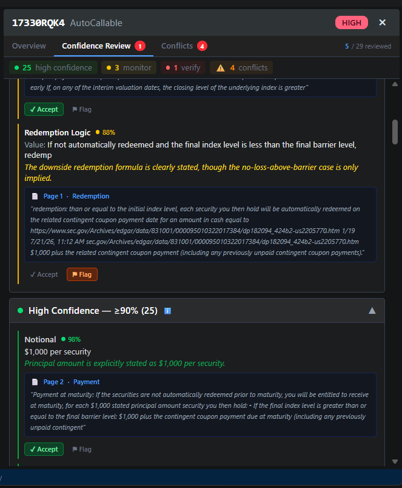

Each field card has two buttons: **Accept** and **Flag**.

- **Accept** — the analyst confirms the extraction is correct. Turns green.
- **Flag** — the analyst marks the field for follow-up or correction. Turns orange.

Review state is persisted to the database. It survives page refreshes, tab switches, and re-ingestion. The reviewed counter in the header increments as fields are actioned.

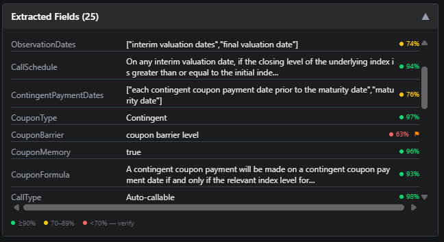

Back on the Overview tab, accepted and flagged fields show small ✓ and ⚑ indicators next to their confidence dots. The review state is visible wherever the field appears.

---

## 7. The Conflicts Tab

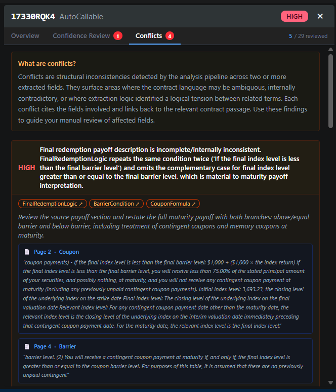

Conflicts are a different signal from confidence scores.

A low confidence score means *"I wasn't sure about this one field."*  
A conflict means *"two fields in this contract are logically inconsistent with each other."*

These need different responses. A low-confidence field might just need a quick document check. A HIGH conflict means the contract language itself may be ambiguous, or the extraction has an internal contradiction that affects how you'd model the payoff.

Each conflict card shows:
- Severity (HIGH / MEDIUM / LOW)
- A plain-language description of the inconsistency
- The fields involved — click any field badge to jump straight to it in the Confidence Review tab
- A source citation linking back to the relevant passage in the document
- A recommendation for how to resolve it

---

## 8. Cross-Tab Navigation

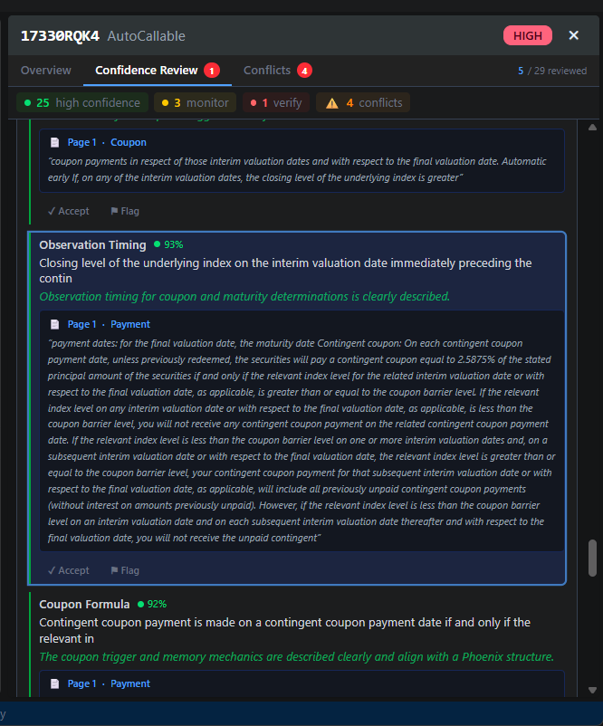

From any conflict card, clicking a field badge navigates you directly to that field in the Confidence Review tab — the correct accordion section opens automatically and the field is highlighted.

This connects the two review surfaces: you can move from *"there is a structural inconsistency"* to *"here is the exact field, its confidence score, the model's reasoning, and the source passage"* in one click.

---

## 9. Asking Questions

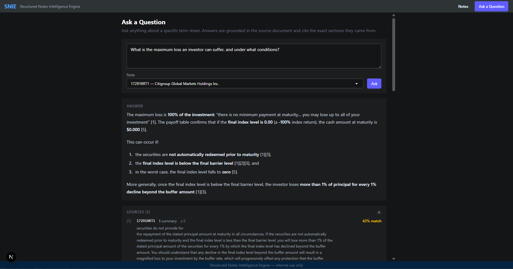

The **Ask a Question** page lets anyone query an ingested note in plain English. Select a note from the dropdown, type a question, and the system retrieves the most relevant passages from the vector store and grounds the LLM's answer in them.

Every claim in the answer has a numbered citation. The Sources section below the answer (collapsible, expanded by default) shows the exact passages used — CUSIP, section, page, relevance score, and full verbatim text.

The model is only permitted to answer from the retrieved contract text. If the answer isn't in the document, it says so.

Example questions that work well:
- *"What is the maximum loss an investor can suffer, and under what conditions?"*
- *"What is the barrier level and how does it affect the payoff at maturity?"*
- *"Does this note have a memory coupon feature?"*
- *"What is the issuer's credit rating and who is the guarantor?"*

---

## Notes for reviewers

**Suggested note to explore:** `17291RRT1` or `17330RQK4` — both are Citigroup AutoCallable notes with barriers, contingent coupons, and enough structural complexity to exercise all the features above. Re-ingest before review to ensure source citations are fresh.

**What this tool is not (yet):**
- It does not replace analyst judgment — it accelerates it. All extracted values should be treated as AI-assisted drafts until reviewed.
- Conflict resolution workflow (accept/flag on conflicts, same as fields) is scoped for the next sprint — the architecture is identical to what field reviews use.
- Review state does not currently track which analyst made the decision. Auth and identity is a Phase 6 item.
- Scanned or image-based PDFs will not extract correctly — use digitally-created PDFs (EDGAR 424B2 filings printed to PDF work reliably).
