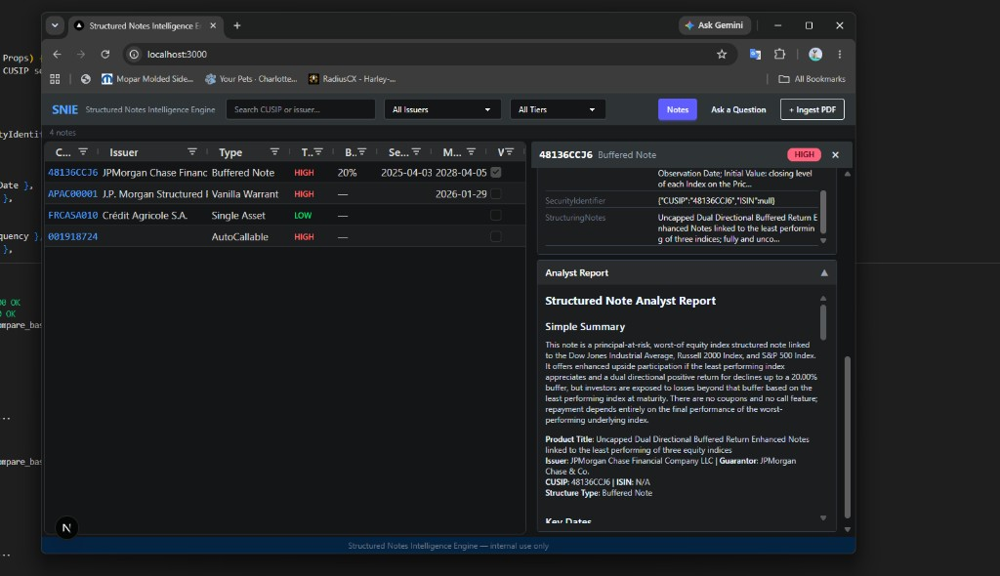
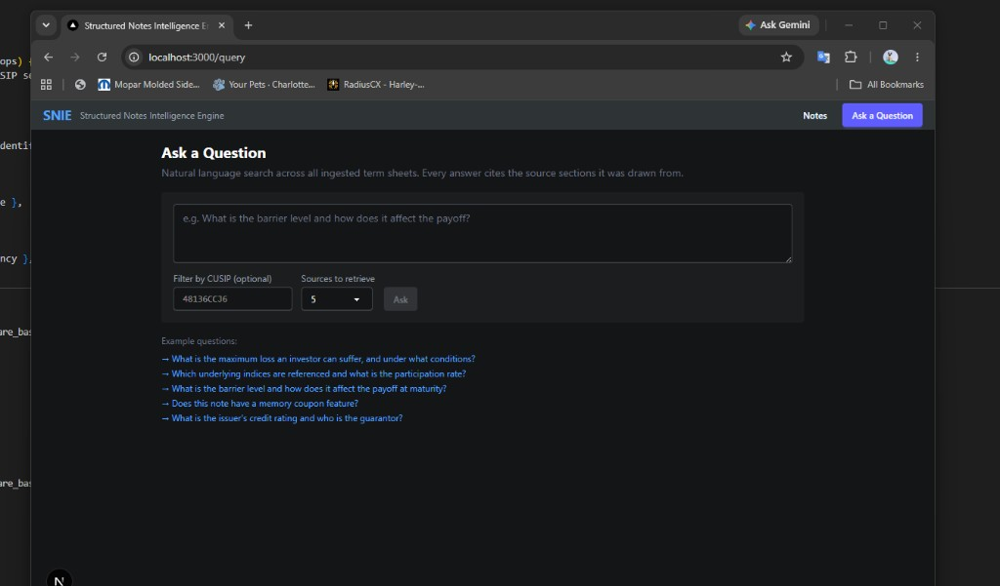
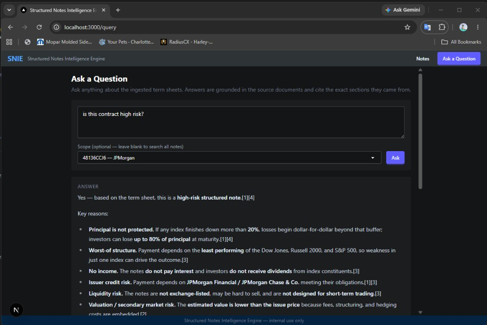

# Demo Walkthrough

This document walks through the key capabilities of the Structured Notes Intelligence Engine using real outputs from the live system.

---

## The Problem

Two prior developers built versions of this tool and both abandoned it. The core issues:

- **No RAG** — both used one-shot LLM calls on raw PDF text. No retrieval, no grounding, no citations.
- **Neo4j graph store** — complex dependency, never worked reliably in production.
- **No intelligence layer** — fields were extracted but never compared against firm baseline rules or scored for confidence.
- **No audit trail** — LLM answers had no source citations. Analysts couldn't verify claims.

---

## What We Built

A full rewrite in ~2 days using RAG-first architecture, LangGraph for deterministic orchestration, and Azure PostgreSQL for persistence.

---

## Scene 1 — The Notes Index

After ingesting 4 sample term sheets, the dashboard shows each note with its risk tier, barrier level, and structure type.



**What you're seeing:**
- AG Grid with risk tier color-coded: `HIGH` (red), `LOW` (green)
- Click any CUSIP → side panel opens with the full intelligence output
- The analyst report is rendered inline — this is LLM-generated markdown from `REPORT_PROMPT`, including confidence icons (✅ ⚠️ ➖), conflict review, and a plain-language summary

The report for `48136CCJ6` (JPMorgan Buffered Note) opened in this panel:
- Correctly identified it as a **worst-of, principal-at-risk** structure
- Flagged the 20% buffer as ambiguous ("barrier level" vs. "buffer amount" — a real wording issue in the contract)
- Used ➖ for coupon and call fields — they don't exist on this note type, so they're structurally null, not low confidence

---

## Scene 2 — Ask a Question

The query page lets anyone ask a plain-English question about any note — or across all notes at once.



The scope dropdown is populated from the notes index. "All Notes" searches across all ingested documents. Scoping to a CUSIP narrows the retrieval to that contract only.

---

## Scene 3 — The Answer

A compliance analyst asks: **"is this contract high risk?"**



**What the engine returned:**
1. **Yes** — with 5 specific reasons, all cited back to source sections
2. Principal at risk (up to 80% loss) cited from `[1][4]`
3. Worst-of structure cited from `[3]`
4. No income (no coupons, no dividends) cited from `[3]`
5. Issuer credit risk (JPMorgan Financial / Chase & Co.) cited from `[1][3]`
6. Liquidity risk and embedded fee discount cited from `[3][2]`

Every bullet is grounded. No hallucination possible — the LLM only sees the retrieved chunks.

This replaces what previously required an analyst to read the full 40-page term sheet manually.

---

## Scene 4 — Cross-Note Global Queries

Because all notes share the same ChromaDB collection, you can ask questions across your entire book:

> "Which notes have a worst-of structure linked to multiple indices?"

> "Are there any notes with a barrier below 60%?"

> "Which issuer has the most notes with principal at risk?"

The answers cite the specific CUSIP and section for each claim — every answer is auditable.

---

## Running It Yourself

```bash
# Deploy Azure infra (one time)
.\infra\deploy.ps1 -SqlPassword <yourpassword>

# Start backend
python -m uvicorn backend.main:app --reload --port 3001

# Start frontend
cd frontend && npm run dev

# Open http://localhost:3000
```

Ingest a term sheet via **+ Ingest PDF** in the header, or use the API directly:

```python
import requests
with open("your_termsheet.pdf", "rb") as f:
    r = requests.post("http://localhost:3001/api/ingest/upload",
                      data={"cusip": "YOUR_CUSIP"},
                      files={"file": f})
print(r.json())
```

See [README.md](README.md) for full setup instructions.

---

## What This Demonstrates

| Capability | Evidence |
|---|---|
| RAG is working | Citations `[1][3]` trace to specific chunks and sections |
| Auditable AI | Every finding links to retrieved source text, not LLM memory |
| Cost-aware routing | LOW notes skip the full intelligence chain (6 fields vs 52) |
| Domain-aware rules | Barrier < 60% flagged deterministically, no LLM needed |
| Production patterns | LangGraph, pinned deps, proper secrets, fail-fast config |
| Reproducible infra | Bicep IaC — any developer, any day, one command |
